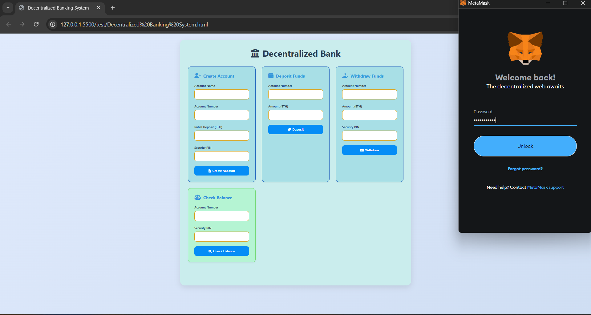
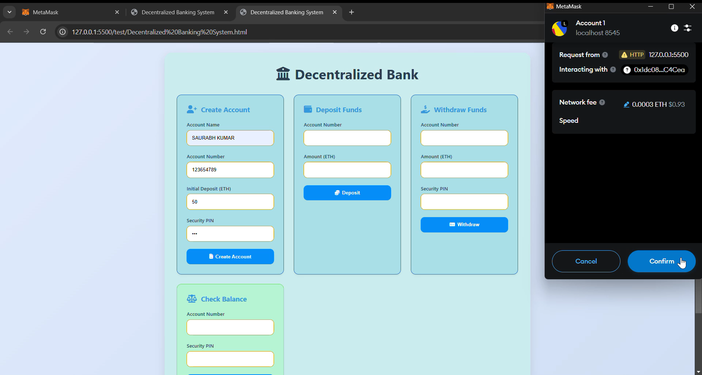
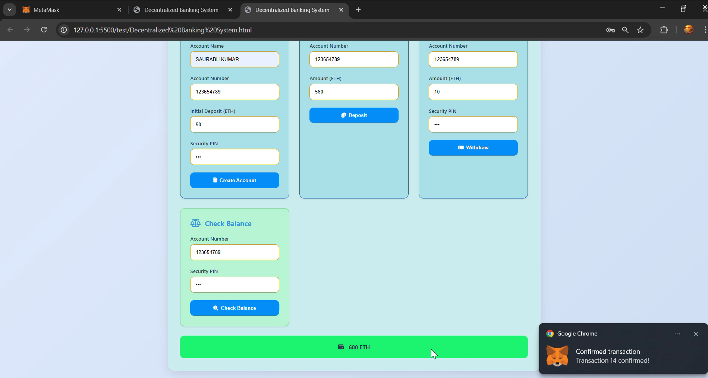
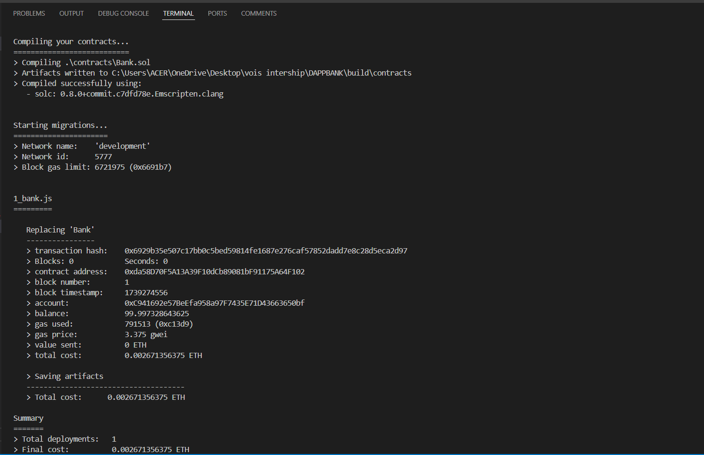

# Decentralized Bank

A decentralized banking system built on the Ethereum blockchain, allowing users to create accounts, deposit funds, withdraw funds, and check balances securely using smart contracts.

## Features

- **Create Account:** Users can create a new bank account with an account name, account number, initial deposit (ETH), and security PIN.
- **Deposit Funds:** Allows users to deposit ETH into their account.
- **Withdraw Funds:** Users can withdraw ETH from their account by providing a security PIN.
- **Check Balance:** Allows users to check the balance of their account using their account number and PIN.

## Interface Preview






## Technologies Used

- **Ethereum Blockchain**
- **Web3.js:** JavaScript library to interact with Ethereum blockchain.
- **MetaMask:** Browser extension to interact with the Ethereum network.
- **HTML, CSS, JavaScript** for frontend design and logic.

## Getting Started

### Prerequisites
1. Install [Node.js](https://nodejs.org/), which is required to manage the project's dependencies.
2. Install [Truffle](https://www.trufflesuite.com/truffle), a framework for smart contract development.
3. Install [Ganache](https://www.trufflesuite.com/ganache), a personal blockchain for Ethereum development.
4. Install **[MetaMask](https://metamask.io/)** and set up an Ethereum account.
5. Ensure you have **[Ether](https://faucet.metamask.io/)** (ETH) for transactions if you’re testing on a test network.

### Steps to Run the Project
1. Clone the repository to your local machine.
2. Navigate into the project folder.
3. Install all necessary dependencies using Node.js and npm (Node Package Manager).
4. Start Ganache to run a local Ethereum blockchain for testing.
5. Compile the smart contracts to prepare them for deployment.
6. Migrate the smart contracts to the local Ethereum blockchain using Truffle.

### Smart Contract Deployment

The smart contract for the decentralized bank is already deployed to the Ethereum blockchain. For now, it's linked to the following contract address:

```text
Contract Address: 0xB86B7A677F070cedeB8e1352De0072Ba5c18F09b
```

If you'd like to deploy it to another network, you can update the `contractAddress` in the JavaScript code accordingly.

